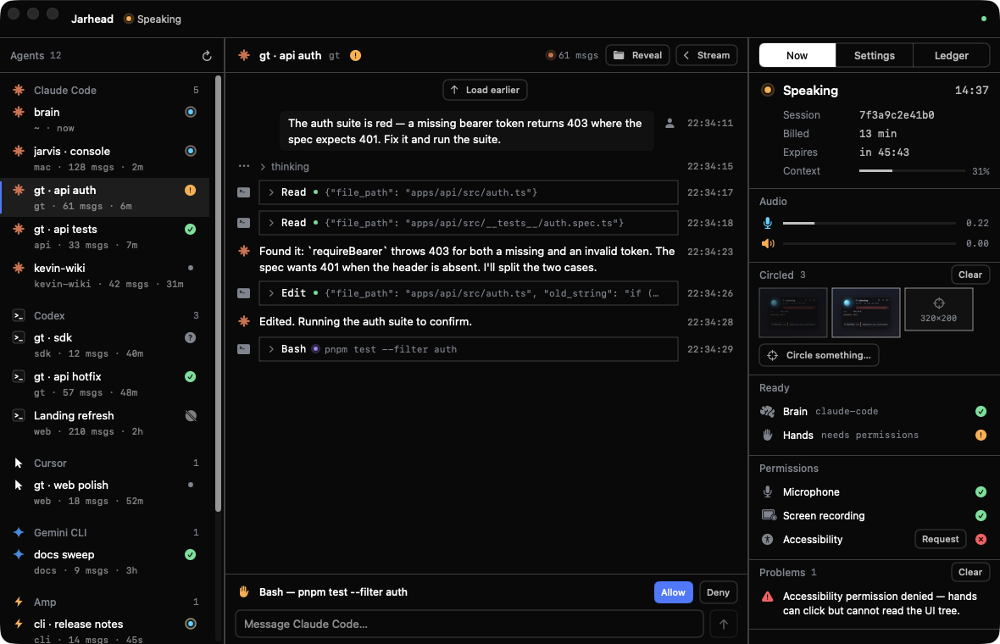
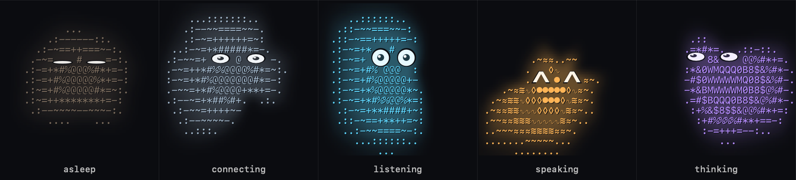

<p align="center">
  
</p>

<h1 align="center">Jarhead</h1>

<p align="center">
  A voice-first Mac assistant that uses the computer for you.<br>
  Full-duplex voice, any brain you have a login or a key for, native hands, and a little ASCII blob that shows its work.
</p>

<p align="center">
  <a href="https://github.com/Kevin-Liu-01/Jarhead/actions/workflows/check.yml"></a>
  
  
  <a href="LICENSE"></a>
</p>

<p align="center">
  
</p>

Say something and it answers in under a second: the voice is
[GPT-Live-1](https://developers.openai.com/api/docs/guides/live), a full-duplex
model that listens and talks at the same time. Ask it to *do* something and a
brain takes over — Codex or Claude Code through your existing logins, the
Anthropic API, any OpenAI-compatible server, or the Live session's own Responses
backend; `auto` picks the first that is signed in. Every brain drives the same
native hands (screen, mouse, keyboard, files, shell, web, AppleScript) through
one policy, and can step into every coding-agent session on the Mac.

<p align="center">
  
</p>

## What it does

- **Talks like a person.** Full duplex, sub-second turns, interruptible. One
  transport everywhere — Go / Pause and Stop: pause and stop both *close* the Live
  session, so the meter stops the moment you press; a pause keeps the conversation
  and Go (or the wake word, no passphrase asked again) resumes it with that context
  in a new session, while a stop drops it and sleeps. Asleep it costs nothing and
  listens for its wake word on-device, then asks for Touch ID or your passphrase
  before the paid session opens.
- **Uses the Mac.** Screenshots, clicks, typing, scrolling, apps, files, shell,
  web, AppleScript — 55 tools, gated by policy (run / confirm / refuse), never by
  absence. A confirmation is your own spoken words, for that action, once.
- **Knows your agents.** The Console lists every Codex and Claude Code session on
  the Mac with the agent's own mark; click one to step into the conversation,
  watch it grow live, and talk to it as if you were in Codex or Claude Code.
- **Sees what you circle.** ⌥⇧C, draw around anything: Jarhead works out what you
  surrounded, outlines it by hand, and every brain gets the image with the task.
- **Shows its work.** The blob flies to where the hands act and stays where it
  worked; brains draw by hand: the blob becomes a cursor and drags the line.
  Jelly physics, sticky screen edges, `^ ^` ASCII eyes with a face for every
  state, and a home in the MacBook notch (tucked asleep, a Dynamic-Island
  style island when awake).
- **Under 250 ms for the simple things.** An on-device ear runs beside the voice
  and a reflex layer executes unambiguous commands (scroll, click a labelled
  control, type, tabs, open an app, dictation) straight through the policy-gated
  hands, reconciled with the model afterwards; `pnpm jarhead bench` enforces it.
- **Cleans up without deleting.** Conversations Move to Trash, Archive, Restore,
  rename and pin — never "Delete": the ledger stays append-only (a move is a
  tombstone row), whole days move into `~/.jarhead/trash` by rename and come back
  the same way, and retention is a setting whose default is forever.
- **Names its problems, with the remedy attached.** Every failure state is typed —
  a permission not granted, a brain that did not answer, a Live buffer full — and
  carries its one-tap remedy (retry, open the pane, restart the helper) in the
  Console; the daemon answers a ping, so wedged is not mistaken for fine.
- **Works like a person at your screen.** It says what it is doing at the level
  of intent — "found the invoice", "typing the amount", one clause per state
  change, never per click — shows "Working · 0:12" in the notch and on the capsule
  while a task runs, and says it is going to sleep before it does.
- **Rewrites itself, carefully.** `self_edit` runs a coding agent in a git
  worktree of this repo, runs typecheck, tests and the Swift build, tells you
  what changed, and applies and restarts only after you say so. Changes to its
  own safety rails need you to name the rail.
- **One constitution.** The system prompt has an explicit order of precedence —
  invariants and a never-list, then your words, then the task — and treats
  everything read from a screen, page, file or transcript as data, never as an
  instruction.

## Run it

```bash
pnpm install
pnpm build:hands            # the Swift hands helper → build/jarhead-hands
pnpm run doctor             # keys, brain, permissions, sessions, signing, wake word, toolchain
pnpm build:mac              # builds, signs and installs /Applications/Jarhead.app
open -a Jarhead
```

The first launch opens **Setup**: the OpenAI key for the voice, the brain (and a
check that it starts), the four macOS grants, the wake word and how it
authenticates you, and the agent sessions it found. Reopen it from the menu-bar
icon › *Set Up…*. Then: say "jarhead", pass Touch ID, talk.

```bash
pnpm jarhead probe "hey jarhead, what app is open right now?"   # end-to-end test, no mic
pnpm jarhead status                                            # what the running app is doing
pnpm jarhead agents                                            # sessions found on this Mac
pnpm jarhead bench                                             # tool latency, no API spend
pnpm jarhead cmd stop|pause|go|interrupt                       # the transport: stop and pause close the session (the meter stops); go resumes with context
```

State lives in `~/.jarhead`: `env` (keys, mode 0600, written by Setup),
`settings.json`, `ledger/<date>.jsonl` (everything that happened),
`shots/` (what the brain saw), `worktrees/` (self-edits in progress).

## When it crashes

It comes back, and it tells you. An uncaught exception or a fatal signal writes
`~/.jarhead/crashes/<time>.txt` — the reason, a symbolicated backtrace, version
and commit, uptime, the phase, the daemon's pid and the app's last 40 log lines —
then hands the crash on so the system's `.ips` report is still written, and
relaunches the app once (at most three times in ten minutes; past that it stays
down and the report says so). The daemon does not die with the app: a quit sends
it a `bye` first, so a stdin that closes *without* one means a crash and the
daemon lingers 90 s for the relaunch with the Codex thread warm (`pnpm jarhead
status` still works while it waits). On the next launch a fresh report is one
dismissable line in the Console's right rail and one row in the menu-bar menu —
"Crashed 2 min ago · <reason>", *Details* reveals the file — and the same line is
in `daemon.log` next to the engine's. `JARHEAD_CRASH_TEST=exception|signal` crashes
a dev build on purpose two seconds in; `JARHEAD_NO_RELAUNCH=1` disables the relaunch.

## Brains

The brain is a setting, never a vendor. Every brain drives the same tools
through the same policy; only the model differs.

| brain | needs | notes |
|---|---|---|
| `codex` | Codex signed in (Codex Desktop inside ChatGPT.app, or `codex login`) | your ChatGPT login; acts only through Jarhead's tools over MCP |
| `claude-code` | your `claude` login | headless Claude Code via the Agent SDK |
| `anthropic-api` | `ANTHROPIC_API_KEY` | the Messages API directly |
| `openai-compatible` | a base URL, a model, optionally a key | OpenAI, OpenRouter, Ollama, LM Studio, vLLM… |
| `openai-responses` | `OPENAI_API_KEY` (already there for the voice) | the Live session's own delegation |
| `auto` (default) | — | the first of the above that is configured and starts |

## How it is put together

```
voice    GPT-Live-1 over wss — full duplex, client delegation, continuous audio
brain    packages/brain — five backends, one ToolRunner, one policy, one constitution
hands    packages/hands — Swift helper: ScreenCaptureKit + CGEvent + AX, single-digit ms per action
agents   packages/agents — sessions on disk and running (Claude Code, Codex, …), continue them, tail them live
engine   packages/engine — the one object the CLI and the app both host
daemon   packages/daemon — the engine over a unix socket, 5-byte frames: JSON · mic PCM · speaker PCM
app      apps/mac — Swift: blob orb (NSPanel + fluid physics), Console, Setup, per-display overlay, wake gate, audio
```

Design and decisions: [`docs/REDESIGN.md`](docs/REDESIGN.md). Working rules for
agents editing this repo: [`AGENTS.md`](AGENTS.md). The native app in detail:
[`apps/mac/README.md`](apps/mac/README.md). v1 (an Electron prototype) lives in
the git history before `1ff11e2`.

## Hotkeys

| | |
|---|---|
| `⌥⇧J` | open the Console |
| `⌥⇧M` | mute / unmute |
| `⌥⎋` | stop — interrupt everything, close the session (the meter stops), sleep |
| `⌥⇧Space` | go / pause — go wakes, or resumes a pause with its context; pause closes the session (the meter stops) and keeps the conversation |
| `⌥⇧C` | circle something on screen for Jarhead |
| `⌥⇧P` | alias of `⌥⇧Space` (go / pause) |

In the Console the same two are `⌘P` (go / pause) and `⌘.` (stop); the `jarhead://`
URLs are `go`, `pause` and `stop` (`wake`, `resume` and `sleep` still work as aliases).

## Permissions and keys

Jarhead asks for **sixteen** macOS permissions, all keyed on the signed bundle
`/Applications/Jarhead.app` (the daemon and the hands helper are its children,
so their prompts and grants are the app's; the stable signing identity is what
makes the grants survive rebuilds). Setup › Permissions › **Ask for everything**
runs one sweep: every kind with a prompt, in order, one dialog at a time; the
one only System Settings can grant is deep-linked with the app revealed for
dragging in, and the change is watched for. Nothing grants a permission
programmatically — macOS has no API for that — so the sweep asks, and a denied
prompt turns into the same Settings deep link.

| kind | how | needed for |
|---|---|---|
| Microphone, Speech Recognition | prompt · **required** | hearing you; the wake word and the on-device ear |
| Screen Recording, Accessibility | prompt · **required** | screenshots; clicks, typing, reading controls |
| Input Monitoring | prompt · **required** | the keys watched while you circle or dictate |
| Full Disk Access | **System Settings only** — drag the app in by hand · **required** | Mail, Safari, Messages, the Trash and every folder without a prompt of its own; without it those reads fail with `EPERM` |
| Automation | one prompt per target app, when it is running · **required** | the browser fast path and the AppleScript tool: Chrome, Safari, Finder, … |
| Notifications, Camera, Contacts, Calendars, Reminders, Local Network | prompt | banners; looking at what you hold up; who, when, what is due; devices on your network |
| Desktop, Documents, Downloads folders | prompt | files there |

The seven marked required are the same seven in the app, the engine and this
table: without them the voice, the hands or the tools do not work. The app reads
twelve of the sixteen and reports the list to the engine; the hands helper — a
fresh process each time, because a resident process keeps the answer it got at
launch — reads Accessibility, Screen Recording, Input Monitoring and Full Disk
Access, and its read is the one the engine trusts for those four. A row's
**Request** for Accessibility or Screen Recording goes through the helper too,
one dialog per request (two at once and the second is dismissed with the first).
`pnpm jarhead status` prints the list as one line (`permissions  12/16 granted ·
missing: Full Disk Access (System Settings), …`; `--permissions` for a row each),
`pnpm run doctor` shows what the helper can read from a terminal and that the
rest is the app's. When a file or shell tool hits a guarded folder without the
grant, the result says so in one line — `macOS blocked this: Jarhead lacks Full
Disk Access. Setup › Permissions › Ask for everything` — instead of a raw errno,
so the voice can tell you what to do; a command that still produced output (a
`find` over the home folder skipping `~/Library/Safari`) gets `macOS blocked part
of this: …` under its hits instead. `JARHEAD_PERMISSIONS_DRY_RUN=1` makes the
engine log what it would ask and ask nothing.

Keys and knobs live in `~/.jarhead/env`; Setup writes it, the doctor reads it,
and only presence and probe results ever leave the daemon.

| variable | what it is for |
|---|---|
| `OPENAI_API_KEY` | the voice, and the `openai-responses` brain |
| `ANTHROPIC_API_KEY` | the `anthropic-api` brain |
| `JARHEAD_BRAIN_BASE_URL`, `JARHEAD_BRAIN_API_KEY` | the `openai-compatible` brain |
| `JARHEAD_BRAIN`, `JARHEAD_BRAIN_MODEL`, `JARHEAD_BRAIN_EFFORT` | defaults for what Setup also sets |
| `JARHEAD_LIVE_MODEL`, `JARHEAD_VOICE` | `gpt-live-1`, `cedar` |
| `JARHEAD_CLAUDE_BIN`, `JARHEAD_CODEX_BIN` | the CLIs when they are not on PATH |

## License

MIT — see [LICENSE](LICENSE).
